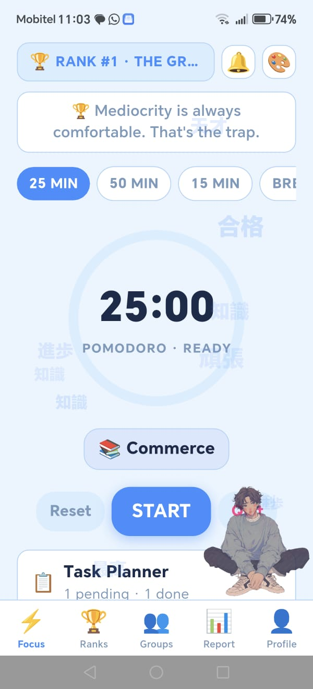
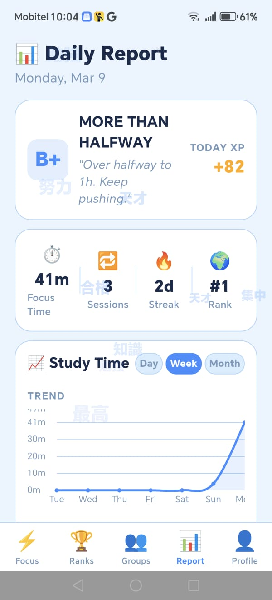
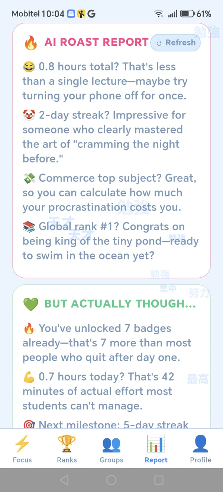
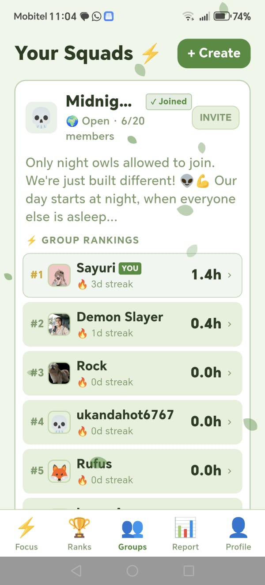
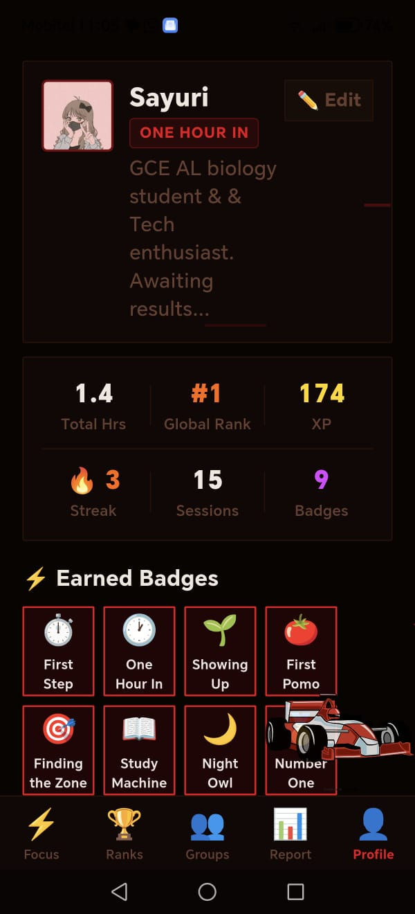

# GrindMode

GrindMode is a **gamified productivity and focus tracking app** built with Flutter.
It helps students stay focused while studying by turning productivity into a competitive and rewarding experience.

## Features

* ⏱ Focus timer for deep study sessions
* 📈 Study reports and productivity tracking
* 🏆 XP system and leaderboards
* 👥 Groups for competing with friends
* 🔥 Daily streak tracking
* 🏅 Unlockable badges
* 🎨 Multiple themes and backgrounds
* 🔐 Firebase authentication (Google login)
* 🤖 AI features and sarcastic motivational roasts

## Screenshots

### Focus Screen


### Reports


### Roast Feature


### Groups


### Leaderboard


### Profile


## Built With

* **Flutter**
* **Firebase Authentication**
* **Cloud Firestore**
* **Firebase Storage**

## Screens

The app includes multiple screens such as:

* Focus timer
* Groups
* Leaderboards
* Reports
* Profile
* Tasks

## Installation

1. Clone the repository

```
git clone https://github.com/SayuSky/grindmode.git
```

2. Navigate to the project folder

```
cd grindmode
```

3. Install dependencies

```
flutter pub get
```

4. Run the app

```
flutter run
```

## Author

Created by **SayuSky**.
